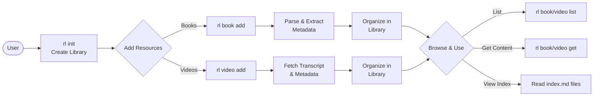

# Resource Librarian

A Python library for creating, maintaining, and indexing a personal library of digital resources. Organize your books and YouTube video transcripts in a way that's perfect for processing with modern AI systems.

## What is Resource Librarian?

Resource Librarian helps you build a **filesystem-based knowledge library** from:
- **Books** (PDF, EPUB, Markdown)
- **YouTube videos** (transcripts and metadata)

No database required - everything is organized in plain files with YAML metadata and Markdown indices.

## Key Features

### 📚 Book Management
- Supports PDF, EPUB, and Markdown formats
- Auto-extracts metadata (title, author, ISBN)
- Automatically splits EPUB into chapters
- Preserves all original formats
- Organizes by author with normalized naming

### 🎥 YouTube Video Management
- Downloads transcripts automatically
- Captures video metadata (title, channel, publish date, tags)
- Organizes by channel
- Resumable batch processing for large collections

### 🗂️ Library Organization
- **Filesystem-first** - All content stored as files, no database
- **YAML manifests** - Structured metadata for each resource
- **Searchable catalog** - YAML-based catalog for quick lookups
- **Generated indices** - Beautiful Markdown index pages for navigation
  - Root README with library statistics and recent additions
  - Channel-level indices for video collections
  - Videos by title index for alphabetical browsing
  - Category indices for topic-based navigation
  - Auto-regenerated when resources are added

### 🔍 Browse Your Library
- List all books - Filter by author, category, or tags
- View available formats - PDF, EPUB, Markdown, chapters
- Retrieve content - Full books or specific chapters
- Access summaries - View existing summaries for any resource
- Navigate with indices - Library-wide and per-book navigation

## How It Works

Resource Librarian follows a simple workflow:



**Key Steps:**
1. **Initialize** - Create library structure with `rl init`
2. **Add Resources** - Import books (PDF/EPUB) or YouTube videos
3. **Auto-Organization** - Files are parsed, organized by author/channel, with metadata extracted
4. **Browse & Access** - List, search, and retrieve content via CLI or filesystem

## Installation

### Prerequisites
- Python 3.11 or higher
- Git

### Install from Source

```bash
# Clone the repository
git clone git@github.com:kennyrnwilson/resource-librarian.git
cd resource-librarian

# Create virtual environment
python -m venv venv
source venv/bin/activate  # On Windows: .\venv\Scripts\Activate.ps1

# Install the package
pip install -e ".[dev]"
```

## Quick Start

### 1. Initialize a Library

Create a new resource library:

```bash
rl init /path/to/my-library
```

This creates:
```
my-library/
├── README.md                       # Root library index with stats
├── catalog.yaml                    # Library catalog (YAML format)
├── _index/                         # Library-wide navigation
├── books/
│   └── _index/                     # Book indices
│       ├── authors.md              # Books grouped by author
│       └── titles.md               # Books alphabetically
├── videos/
│   └── _index/                     # Video indices
│       ├── channels.md             # Videos grouped by channel
│       └── titles.md               # Videos alphabetically
└── categories/
    └── index.md                    # All categories with links
```

### 2. Add Books

#### Option A: Add a Single Book File

```bash
# Add a single book (auto-detects metadata)
rl book add /path/to/book.epub

# Add a book with manual metadata and tags
rl book add /path/to/book.pdf \
  --author "John Smith" \
  --categories "Programming,Python" \
  --tags "beginner,tutorial"
```

#### Option B: Import from a Structured Folder

If you have books organized in folders with summaries:

```bash
# Import a book from a structured folder
rl book import-folder /path/to/book-folder

# Example folder structure:
# my-book/
# ├── my-book.epub                      # Main book file
# ├── my-book.pdf                       # Alternative format
# ├── my-book-summary-shortform.pdf     # Summary files
# └── my-book-summary-claude.md

# With categories and metadata
rl book import-folder ./python-programming \
  --categories "Programming,Python" \
  --tags "beginner,tutorial"
```

The `import-folder` command will:
- Auto-detect all book formats (PDF, EPUB, Markdown)
- Auto-detect summary files (folder-name-summary-type.ext)
- Convert summaries to Markdown if needed
- Extract chapters from EPUB files
- Auto-detect metadata from EPUB or text content
```

**Note:** Both `book add` and `book import-folder` create the same organized structure:

```text
books/author-lastname-firstname/book-title/
├── full-book-formats/              # All book formats
│   ├── book-title.epub             # Original EPUB
│   ├── book-title.pdf              # Original PDF
│   ├── book-title.md               # Extracted Markdown
│   └── chapters/                   # Extracted chapters (from EPUB)
│       ├── 01-chapter-one.md
│       ├── 02-chapter-two.md
│       └── ...
├── summaries/                      # Book summaries
│   ├── shortform-summary.md
│   └── claude-summary.md
└── manifest.yaml                   # Book metadata
```


### 3. Add YouTube Videos

**Note:** You need a YouTube Data API key. Get one from https://console.cloud.google.com/ and set:

```bash
export YOUTUBE_API_KEY="your-api-key-here"
```

Then fetch videos:

```bash
# Fetch a single video by URL
rl video fetch https://www.youtube.com/watch?v=VIDEO_ID

# Fetch by video ID
rl video fetch VIDEO_ID

# Fetch with categories and tags
rl video fetch "https://youtu.be/VIDEO_ID" \
  --categories "Education,Programming" \
  --tags "tutorial,python"
```

### 4. Browse Your Library

```bash
# List all books
rl book list

# List books with filters
rl book list --author "John Smith"
rl book list --category "Programming"
rl book list --tag "python"

# List all videos
rl video list

# List videos with filters
rl video list --channel "Tech Channel"
rl video list --category "Education"
rl video list --tag "tutorial"
```

### 5. Access Content

```bash
# Get book content (displays or saves to file)
rl book get "Python Programming"
rl book get "Python Programming" --output /path/to/output.md

# Get video transcript (displays or saves to file)
rl video get "Video Title"
rl video get "Video Title" --output /path/to/transcript.txt
```

### 6. Manage the Catalog

```bash
# Rebuild catalog from filesystem (if it gets out of sync)
rl catalog rebuild

# View library statistics
rl catalog stats
```

The catalog is automatically updated when you add books or fetch videos. The `rebuild` command scans your library directory and regenerates the catalog from scratch, which is useful if:
- You manually moved files around
- The catalog file was deleted or corrupted
- You want to ensure catalog is in perfect sync with the filesystem

## Library Structure

Your library is organized in a clear filesystem hierarchy:

```text
my-library/
├── README.md                      # Root library index with stats & recent additions
├── catalog.yaml                   # Searchable library catalog
├── _index/                        # Library-wide navigation
├── books/
│   ├── _index/                   # Book-wide indices
│   │   ├── authors.md            # Books grouped by author
│   │   └── titles.md             # Books alphabetically
│   └── smith-john/               # Books organized by author
│       └── python-programming/
│           ├── manifest.yaml     # Book metadata
│           ├── full-book-formats/  # All book formats
│           │   ├── python-programming.epub
│           │   ├── python-programming.pdf
│           │   ├── python-programming.md
│           │   └── chapters/     # Extracted chapters
│           │       ├── 01-introduction.md
│           │       └── 02-basics.md
│           └── summaries/        # Book summaries
│               └── shortform-summary.md
├── videos/
│   ├── _index/
│   │   ├── channels.md           # Videos grouped by channel
│   │   └── titles.md             # Videos alphabetically
│   └── tech-channel__UCxxxxx/    # Videos organized by channel
│       ├── index.md              # Channel navigation page
│       └── video-title/
│           ├── manifest.yaml     # Video metadata
│           └── transcript.md     # Video transcript
└── categories/
    └── index.md                   # All categories with links
```

## Command Reference

Get help on any command:

```bash
rl --help           # All commands
rl --version        # Show version (also: -v)
rl book --help      # Book commands
rl video --help     # Video commands
rl catalog --help   # Catalog commands
```

### Available Commands

**General:**
- `rl --version` (or `-v`) - Show version information

**Library Management:**
- `rl init <path>` - Initialize a new library

**Book Commands:**
- `rl book add <file>` - Add a book to the library
- `rl book list` - List all books (with filters)
- `rl book get <title>` - Retrieve book content

**Video Commands:**
- `rl video fetch <url>` - Fetch a YouTube video transcript
- `rl video list` - List all videos (with filters)
- `rl video get <title>` - Retrieve video transcript

**Catalog Commands:**
- `rl catalog rebuild` - Rebuild catalog from filesystem
- `rl catalog stats` - Show library statistics

**Note:** Some commands are still in development. See [docs/CLI_COMMANDS_ANALYSIS.md](docs/CLI_COMMANDS_ANALYSIS.md) for the full roadmap.

## Documentation

### For Users
- **[Installation & Quick Start](#installation)** - Get started quickly
- **[Command Reference](#command-reference)** - Available CLI commands
- **[Library Structure](#library-structure)** - How your library is organized

### For Developers
- **[Getting Started](docs/GETTING_STARTED.md)** - Developer onboarding and setup
- **[Architecture](docs/ARCHITECTURE.md)** - System design and structure
- **[Dependencies](docs/DEPENDENCIES.md)** - Package choices and rationale
- **[Parsing](docs/PARSING.md)** - Document parsing implementation

## Development Workflow

### Running Tests and Checks Locally

Before pushing code, run all CI/CD checks locally:

```bash
# Quick check script (recommended)
./check.sh

# Or manually:
source venv/bin/activate
ruff check .                          # Linting
ruff format --check .                 # Formatting check
pytest --cov=src/resourcelibrarian   # Tests with coverage
```

### Pre-Push Hook

The project includes a **pre-push Git hook** that automatically runs all checks before pushing to remote. This prevents failed CI/CD builds:

- ✅ Automatically runs on `git push`
- ✅ Blocks push if linting, formatting, or tests fail
- ✅ Located at `.git/hooks/pre-push`

The hook runs:
1. Ruff linting (`ruff check .`)
2. Ruff formatting check (`ruff format --check .`)
3. Full test suite with coverage (`pytest`)

If any check fails, the push is aborted with clear error messages.

## License

TBD

## Author

Kenny Wilson
