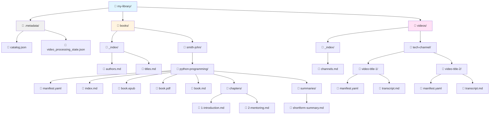

# Resource Librarian

A Python library for creating, maintaining, and indexing a personal library of digital resources. Organize your books and YouTube video transcripts in a way that's perfect for processing with modern AI systems.

## What is Resource Librarian?

Resource Librarian helps you build a **filesystem-based knowledge library** from:
- **Books** (PDF, EPUB, Markdown)
- **YouTube videos** (transcripts and metadata)

No database required - everything is organized in plain files with YAML metadata and Markdown indices.

## Key Features

### 📚 Book Management
- Supports PDF, EPUB, and Markdown formats
- Auto-extracts metadata (title, author, ISBN)
- Automatically splits EPUB into chapters
- Preserves all original formats
- Organizes by author with normalized naming

### 🎥 YouTube Video Management
- Downloads transcripts automatically
- Captures video metadata (title, channel, publish date, tags)
- Organizes by channel
- Resumable batch processing for large collections

### 🗂️ Library Organization
- **Filesystem-first** - All content stored as files, no database
- **YAML manifests** - Structured metadata for each resource
- **Searchable catalog** - JSON-based catalog for quick lookups
- **Generated indices** - Beautiful Markdown index pages

### 🔍 Browse Your Library
- List all books - Filter by author, category, or tags
- View available formats - PDF, EPUB, Markdown, chapters
- Retrieve content - Full books or specific chapters
- Access summaries - View existing summaries for any resource
- Navigate with indices - Library-wide and per-book navigation

## How It Works

Resource Librarian follows a simple workflow:


**Key Steps:**
1. **Initialize** - Create library structure with `rl init`
2. **Add Resources** - Import books (PDF/EPUB) or YouTube videos
3. **Auto-Organization** - Files are parsed, organized by author/channel, with metadata extracted
4. **Browse & Access** - List, search, and retrieve content via CLI or filesystem

## Installation

### Prerequisites
- Python 3.11 or higher
- Git

### Install from Source

```bash
# Clone the repository
git clone git@github.com:kennyrnwilson/resource-librarian.git
cd resource-librarian

# Create virtual environment
python -m venv venv
source venv/bin/activate  # On Windows: .\venv\Scripts\Activate.ps1

# Install the package
pip install -e ".[dev]"
```

## Quick Start

### 1. Initialize a Library

Create a new resource library:

```bash
rl init /path/to/my-library
```

This creates:
```
my-library/
├── .metadata/
│   ├── catalog.json                # Searchable catalog
│   └── video_processing_state.json # Video processing tracker
├── books/
│   └── _index/
│       ├── authors.md              # Books by author
│       └── titles.md               # Books by title
└── videos/
    └── _index/
        └── channels.md             # Videos by channel
```

### 2. Add Books

```bash
# Add a single book (auto-detects metadata)
rl book add /path/to/book.epub

# Add a book with manual metadata
rl book add /path/to/book.pdf --title "Python Programming" --author "John Smith"

# Add from a folder (with summaries and multiple formats)
rl book add-folder /path/to/book-folder
```

### 3. Add YouTube Videos

```bash
# Add a single video
rl video add https://www.youtube.com/watch?v=VIDEO_ID

# Add an entire channel
rl video add-channel https://www.youtube.com/channel/CHANNEL_ID

# Batch add from URLs file
rl video batch /path/to/urls.txt
```

### 4. Browse Your Library

```bash
# List all books
rl book list

# List books by specific author
rl book list --author "John Smith"

# List videos
rl video list

# List videos from specific channel
rl video list --channel "Tech Channel"
```

### 5. Access Content

```bash
# Get book content
rl book get "Python Programming"

# Get specific chapter
rl book get "Python Programming" --chapter 3

# Get video transcript
rl video get VIDEO_ID
```

## Library Structure

Your library is organized in a clear filesystem hierarchy:



**Structure Overview:**

```
my-library/
├── .metadata/                     # Internal library data
│   ├── catalog.json              # Searchable catalog
│   └── video_processing_state.json
├── books/
│   ├── _index/                   # Library-wide indices
│   │   ├── authors.md
│   │   └── titles.md
│   └── smith-john/               # Books organized by author
│       └── python-programming/
│           ├── manifest.yaml     # Book metadata
│           ├── index.md          # Book navigation
│           ├── *.epub, *.pdf, *.md  # Multiple formats
│           ├── chapters/         # Individual chapters
│           └── summaries/        # Book summaries
└── videos/
    ├── _index/
    │   └── channels.md
    └── tech-channel/             # Videos organized by channel
        └── video-title/
            ├── manifest.yaml
            └── transcript.md
```

## Command Reference

Get help on any command:

```bash
rl --help           # All commands
rl book --help      # Book commands
rl video --help     # Video commands
```

**Note:** Some commands are still in development. See [docs/CLI_COMMANDS_ANALYSIS.md](docs/CLI_COMMANDS_ANALYSIS.md) for the full roadmap.

## Documentation

### For Users
- **[Installation & Quick Start](#installation)** - Get started quickly
- **[Command Reference](#command-reference)** - Available CLI commands
- **[Library Structure](#library-structure)** - How your library is organized

### For Developers
- **[Development Guide](docs/DEVELOPMENT.md)** - Setup, testing, and contributing
- **[Implementation Plan](docs/IMPLEMENTATION_PLAN.md)** - Project roadmap and phases
- **[CLI Commands Analysis](docs/CLI_COMMANDS_ANALYSIS.md)** - Complete command specifications
- **[Session Recovery Guide](docs/SESSION_RECOVERY.md)** - Development session continuity

## License

TBD

## Author

Kenny Wilson
