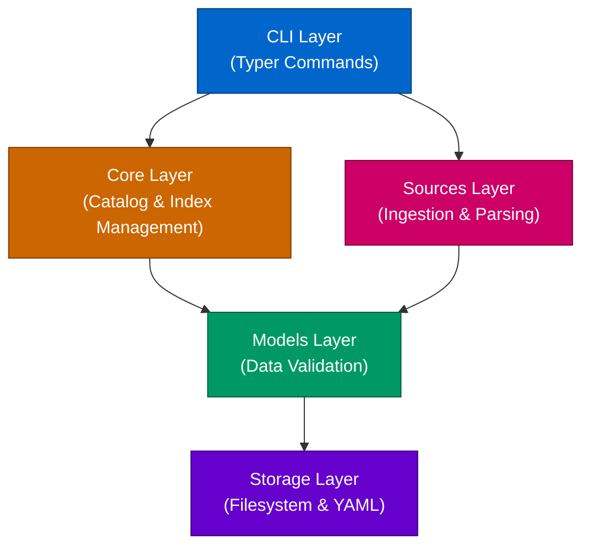
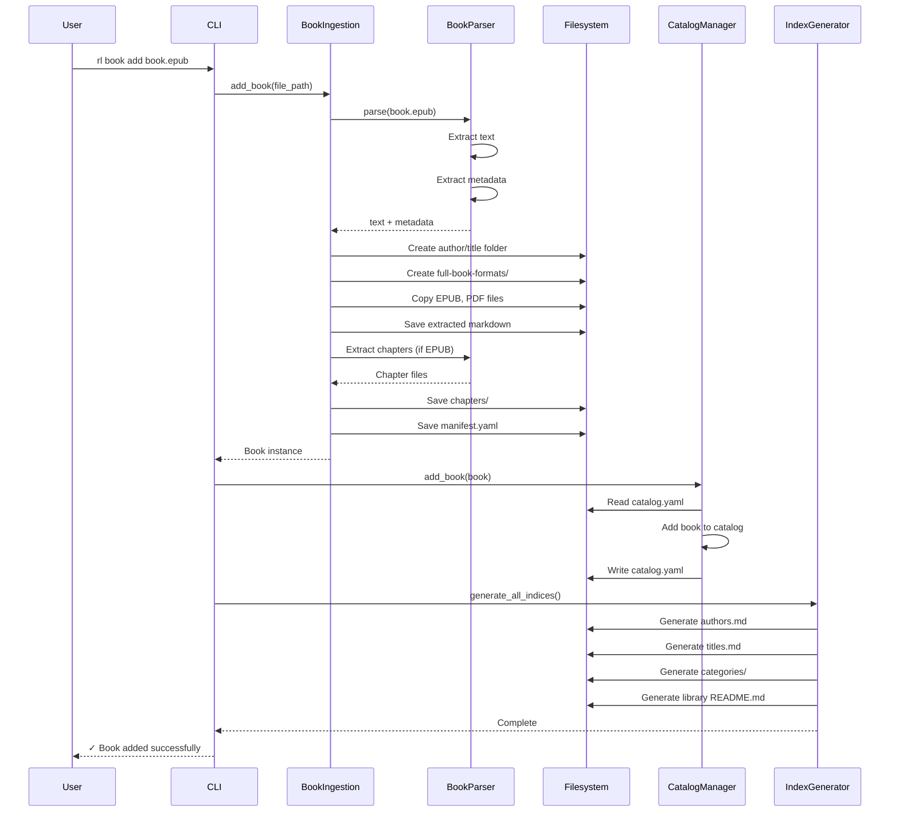
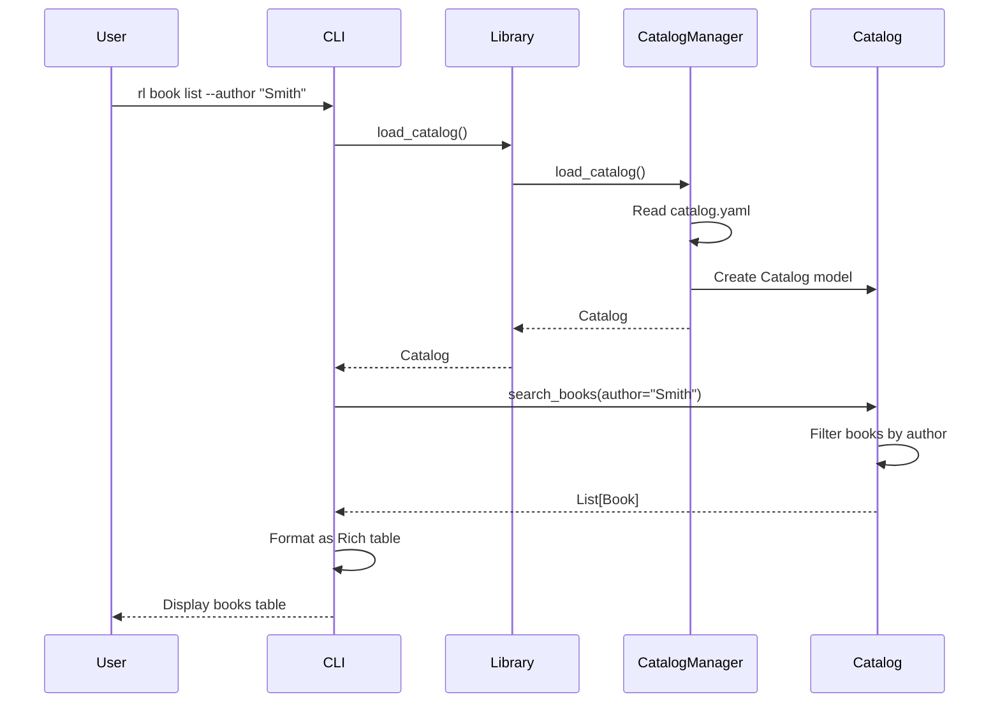

# Architecture

This document provides a comprehensive overview of Resource Librarian's architecture, design philosophy, and key technical decisions.

---

## Table of Contents

- [System Philosophy](#system-philosophy)
- [High-Level Architecture](#high-level-architecture)
- [System Layers](#system-layers)
- [Data Flow](#data-flow)
- [Module Organization](#module-organization)
- [Design Patterns](#design-patterns)
- [Key Architectural Decisions](#key-architectural-decisions)

---

## System Philosophy

Resource Librarian is built on three core principles:

### 1. Filesystem-First Design

**Everything is a file.** No database, no proprietary formats, no lock-in.

```text
books/smith-john/python-programming/
├── manifest.yaml              # Human-readable metadata
├── full-book-formats/
│   ├── python-programming.epub
│   ├── python-programming.pdf
│   ├── python-programming.md
│   └── chapters/
│       ├── 01-introduction.md
│       └── 02-basics.md
└── summaries/
    └── shortform-summary.md
```

**Benefits:**
- **Portable** - Copy folder = copy library
- **Inspectable** - Open any file in text editor
- **Version-controllable** - Use git for history
- **AI-friendly** - LLMs can read files directly
- **Tool-agnostic** - Use any text editor, grep, find, etc.

### 2. YAML for Structure, Markdown for Content

**YAML** for structured metadata (manifests, catalog):
- Human-readable and editable
- Type-safe with Pydantic validation
- Supports comments (unlike JSON)
- Standard format for configuration

**Markdown** for content and navigation:
- Universal format for text
- Renders nicely in browsers, editors, GitHub
- Easy to generate programmatically
- Perfect for AI consumption

### 3. Generated Indices for Navigation

Indices are **generated, not manually maintained**:
- Regenerated when resources are added
- Always in sync with filesystem
- Multiple views: by author/channel, by title, by category
- Can be deleted and rebuilt anytime

---

## High-Level Architecture

Resource Librarian is organized into distinct layers:



---

## System Layers

### 1. CLI Layer (`cli/`)

**Purpose:** User interface via command-line

**Technologies:**
- [Typer](https://typer.tiangolo.com/) - Type-safe CLI framework
- [Rich](https://rich.readthedocs.io/) - Beautiful terminal output

**Responsibilities:**
- Parse command-line arguments
- Validate user input
- Call appropriate core/source functions
- Display formatted output (tables, panels)
- Handle errors gracefully

**Example Flow:**
```python
@book_app.command("add")
def book_add(file_path: str, author: str | None = None):
    # 1. Validate input
    # 2. Call BookIngestion
    # 3. Update Catalog
    # 4. Regenerate Indices
    # 5. Display success message
```

### 2. Core Layer (`core/`)

**Purpose:** Core library operations (catalog, indexing)

**Components:**
- `CatalogManager` - CRUD operations on catalog
- `IndexGenerator` - Generate markdown indices

**Responsibilities:**
- Maintain catalog.yaml (add/remove/search resources)
- Generate navigation indices (authors, titles, categories)
- Keep catalog in sync with filesystem

**Catalog Structure:**
```yaml
books:
  - source_folder: smith-john/python-programming
    title: Python Programming
    author: John Smith
videos:
  - video_id: abc123
    title: How to Python
    channel_id: UC123
```

### 3. Sources Layer (`sources/`)

**Purpose:** Resource ingestion and processing

**Technologies:**
- [PyMuPDF](https://pymupdf.readthedocs.io/) - PDF text extraction
- [ebooklib](https://github.com/aerkalov/ebooklib) - EPUB parsing
- [BeautifulSoup4](https://www.crummy.com/software/BeautifulSoup/bs4/doc/) - HTML/XML parsing for EPUB content
- [google-api-python-client](https://github.com/googleapis/google-api-python-client) - YouTube Data API
- [youtube-transcript-api](https://github.com/jdepoix/youtube-transcript-api) - YouTube transcript fetching

**Components:**
- `BookIngestion` - Import books from files/folders
- `BookParser` - Parse EPUB, PDF, Markdown
- `BookFolderScanner` - Scan structured book folders
- `EpubChapterExtractor` - Extract chapters from EPUB
- `VideoIngestion` - Import YouTube videos
- `YouTubeAPI` - Fetch video metadata
- `YouTubeTranscript` - Fetch video transcripts

**Responsibilities:**
- Parse source files (EPUB, PDF, etc.)
- Extract metadata (title, author, ISBN)
- Create folder structure
- Save files in organized layout
- Create manifest.yaml

### 4. Models Layer (`models/`)

**Purpose:** Data structures and validation

**Technologies:**
- Pydantic - Type-safe data validation

**Components:**
- `Book` - Book resource with methods
- `BookManifest` - Book metadata (Pydantic model)
- `Video` - Video resource with methods
- `VideoManifest` - Video metadata (Pydantic model)
- `Catalog` - Library catalog (Pydantic model)

**Example Model:**
```python
class BookManifest(BaseModel):
    title: str = Field(..., min_length=1)
    author: str = Field(..., min_length=1)
    isbn: str | None = None
    categories: list[str] = Field(default_factory=list)
    formats: dict[str, str]  # format_name -> relative_path
    summaries: dict[str, str]  # summary_type -> relative_path
```

### 5. Storage Layer (Filesystem)

**Purpose:** Persistent storage

**Technologies:**
- Filesystem - Files and folders
- YAML - Structured data (manifests, catalog)
- Markdown - Content and navigation

**Structure:**
```text
library/
├── catalog.yaml           # Central catalog
├── books/                 # Book resources
├── videos/                # Video resources
└── categories/            # Category indices
```

---

## Data Flow

### Adding a Book



### Searching for Books



---

## Module Organization

```text
src/resourcelibrarian/
├── __init__.py              # Package initialization
├── __main__.py              # CLI entry point
├── library.py               # ResourceLibrary class
│
├── cli/                     # Command-line interface
│   ├── __init__.py
│   └── commands.py          # All CLI commands
│
├── core/                    # Core library systems
│   ├── __init__.py
│   ├── catalog_manager.py   # Catalog CRUD
│   └── index_generator.py   # Index generation
│
├── models/                  # Data models
│   ├── __init__.py
│   ├── base.py             # Base model classes
│   ├── book.py             # Book + BookManifest
│   ├── video.py            # Video + VideoManifest
│   └── catalog.py          # Catalog model
│
├── sources/                 # Resource ingestion
│   ├── __init__.py
│   ├── book_ingestion.py            # Book import
│   ├── book_parser.py               # EPUB/PDF parsing
│   ├── book_folder_scanner.py       # Folder scanning
│   ├── epub_chapter_extractor.py    # Chapter extraction
│   ├── video_ingestion.py           # Video import
│   ├── youtube_api.py               # YouTube Data API
│   └── youtube_transcript.py        # Transcript fetching
│
└── utils/                   # Utilities
    ├── __init__.py
    ├── hash.py             # Hashing
    └── io.py               # File I/O helpers
```

**Design Rationale:**

- **Separation of concerns** - Each module has one responsibility
- **Layered architecture** - Clear dependencies (CLI → Core → Sources → Models)
- **Low coupling** - Modules communicate through well-defined interfaces
- **High cohesion** - Related functionality grouped together

---

## Design Patterns

### 1. Factory Pattern (Model Creation)

Models are created from YAML data using factory methods:

```python
class Book:
    @classmethod
    def from_folder(cls, folder_path: Path) -> "Book":
        """Create Book from folder with manifest."""
        manifest_path = folder_path / "manifest.yaml"
        data = yaml.safe_load(manifest_path.read_text())
        manifest = BookManifest(**data)  # Pydantic validation
        return cls(folder_path=folder_path, manifest=manifest)
```

**Benefits:**
- Encapsulates object creation logic
- Validation happens in one place
- Easy to add new creation methods

### 2. Strategy Pattern (Parsing)

Different parsers for different formats:

```python
class BookParser:
    @staticmethod
    def parse(file_path: Path) -> str:
        """Parse book file based on format."""
        format_type = BookParser.detect_format(file_path)

        if format_type == "epub":
            return BookParser.parse_epub(file_path)
        elif format_type == "pdf":
            return BookParser.parse_pdf(file_path)
        elif format_type == "md":
            return BookParser.parse_markdown(file_path)
```

**Benefits:**
- Easy to add new formats
- Each parser is independent
- Format detection is centralized

### 3. Template Method (Ingestion)

Common ingestion flow with format-specific steps:

```python
class BookIngestion:
    def add_book(self, file_path: Path) -> Book:
        # 1. Parse (format-specific)
        text = BookParser.parse(file_path)

        # 2. Extract metadata (format-specific)
        metadata = extract_metadata(file_path)

        # 3. Create folder (common)
        book_folder = create_folder_structure(metadata)

        # 4. Save files (common)
        save_files(book_folder, files)

        # 5. Create manifest (common)
        manifest = create_manifest(metadata)
```

### 4. Repository Pattern (Catalog)

Catalog acts as repository for resources:

```python
class CatalogManager:
    def add_book(self, book: Book) -> None:
        """Add book to catalog."""

    def remove_book(self, title: str) -> None:
        """Remove book from catalog."""

    def find_book(self, title: str) -> Book | None:
        """Find book by title."""

    def search_books(self, **filters) -> list[Book]:
        """Search books with filters."""
```

**Benefits:**
- Abstract storage details
- Centralized query logic
- Easy to change storage mechanism

---

## Key Architectural Decisions

### Why Filesystem Instead of Database?

**Rationale:**
1. **Simplicity** - No database setup, migrations, or administration
2. **Portability** - Copy folder = copy library
3. **Human-readable** - Files can be read/edited directly
4. **Version control** - Use git for history
5. **Tool compatibility** - Any tool can read files (grep, find, editors)
6. **AI-friendly** - LLMs can directly access file contents

**Trade-offs:**
- ✅ Simple, portable, inspectable
- ✅ No database dependencies
- ❌ Slower search than indexed database
- ❌ No transactions or ACID guarantees

**Mitigation:**
- Catalog provides fast search (YAML is fast to parse)
- Filesystem operations are atomic enough for single-user
- Could add SQLite index later if needed (without changing file structure)

### Why YAML for Manifests?

**Rationale:**
1. **Human-readable** - Easy to read and edit manually
2. **Comments** - Support for documentation (unlike JSON)
3. **Type-safe** - Pydantic validates structure
4. **Standard** - Widely used for configuration
5. **Git-friendly** - Diffs are readable

**Alternatives considered:**
- JSON - Less readable, no comments
- TOML - Good, but YAML more common for this use case
- SQLite - Not human-readable

### Why Generated Indices?

**Rationale:**
1. **Single source of truth** - Catalog is authoritative
2. **Always in sync** - Regenerated when catalog changes
3. **Multiple views** - Authors, titles, categories from same data
4. **Recoverable** - Can delete and rebuild anytime
5. **Flexible** - Easy to add new index types

**Alternatives considered:**
- Manual indices - Out of sync, error-prone
- Database views - Requires database
- No indices - Poor discoverability

### Why Pydantic for Models?

**Rationale:**
1. **Type safety** - Runtime validation of YAML data
2. **Documentation** - Models are self-documenting
3. **Serialization** - Easy to/from dictionaries
4. **Modern** - Uses Python 3.11+ type hints
5. **Performance** - Pydantic v2 is fast (Rust core)

**Alternatives considered:**
- dataclasses - No validation
- attrs - Less validation, less adoption
- Plain dicts - No type safety, error-prone

### Why Typer for CLI?

**Rationale:**
1. **Type hints** - Function signatures = CLI interface
2. **Minimal code** - No manual argument parsing
3. **Rich integration** - Beautiful terminal output
4. **Modern** - Built for Python 3.6+
5. **Excellent docs** - Easy to learn and use

**Alternatives considered:**
- Click - More verbose, no type hints
- argparse - Too much boilerplate
- Fire - Too magical, harder to control

### Why PyMuPDF for PDFs?

**Rationale:**
1. **Speed** - 10x faster than alternatives
2. **Accuracy** - Better text extraction quality
3. **Maintained** - Active development
4. **Full-featured** - Handles complex PDFs

**Alternatives considered:**
- PyPDF2 - Slower, less accurate
- pdfplumber - Slower, focused on tables
- pdfminer.six - Complex API, slower

### Why Single `commands.py` File?

**Rationale:**
1. **Simplicity** - All commands in one place
2. **Easy to navigate** - No need to jump between files
3. **Shared context** - Common imports and helpers
4. **Small codebase** - Not enough commands to warrant splitting

**Future consideration:**
- If commands grow significantly (>1500 lines), split into:
  - `cli/book_commands.py`
  - `cli/video_commands.py`
  - `cli/catalog_commands.py`

---

## Extension Points

Resource Librarian is designed to be extensible:

### Adding New Resource Types

1. Create model in `models/` (e.g., `Article`, `Podcast`)
2. Create ingestion in `sources/` (e.g., `ArticleIngestion`)
3. Add to catalog model
4. Add CLI commands
5. Update index generator

### Adding New Book Formats

1. Add format detection to `BookParser.detect_format()`
2. Add parser method (e.g., `BookParser.parse_docx()`)
3. Update `BookParser.parse()` dispatcher
4. Add tests

### Adding New Index Types

1. Add method to `IndexGenerator` (e.g., `generate_tag_index()`)
2. Call from `generate_all_indices()`
3. Update filesystem structure docs

### Adding Search Capabilities

1. Add search methods to `Catalog` model
2. Add CLI commands for search
3. Optionally: Add SQLite index for faster search (keeping files as source of truth)

---

## Performance Considerations

### Current Performance

- **Book ingestion**: ~2-5 seconds per book (EPUB with chapters)
- **Video ingestion**: ~1-2 seconds per video (network dependent)
- **Catalog rebuild**: <1 second for 100 resources
- **Index generation**: <1 second for 100 resources

### Scalability

**Current limitations:**
- Catalog loads entire YAML into memory (fine for <10,000 resources)
- Index generation is single-threaded (fine for <1,000 resources)

**Future optimizations (if needed):**
1. **Streaming YAML parsing** - For very large catalogs
2. **Parallel index generation** - Use multiprocessing
3. **Incremental indexing** - Only update changed resources
4. **SQLite search index** - For faster search (keep files as source)

---

## Security Considerations

### File Safety

- **YAML safe loading** - Use `yaml.safe_load()` to prevent code execution
- **Path validation** - Validate all file paths to prevent directory traversal
- **No shell commands** - Use Python stdlib, not shell execution

### API Keys

- **Environment variables** - Store YouTube API key in env vars, not files
- **No key logging** - API keys never logged or printed
- **User responsibility** - Users manage their own API keys

---

## Testing Strategy

See [TESTING.md](TESTING.md) for detailed testing documentation.

**Architecture supports testing:**
- **Layered design** - Each layer can be tested independently
- **Dependency injection** - Easy to mock dependencies
- **Filesystem-based** - Use temp directories for tests
- **Pydantic models** - Validation errors are testable

---

## Related Documentation

- **[Getting Started](GETTING_STARTED.md)** - Developer setup and first steps
- **[Dependencies](DEPENDENCIES.md)** - Package choices explained
- **[Parsing](PARSING.md)** - Document parsing implementation
- **[Modules](modules/)** - Detailed module documentation

---

**Last Updated:** 2025-11-29
