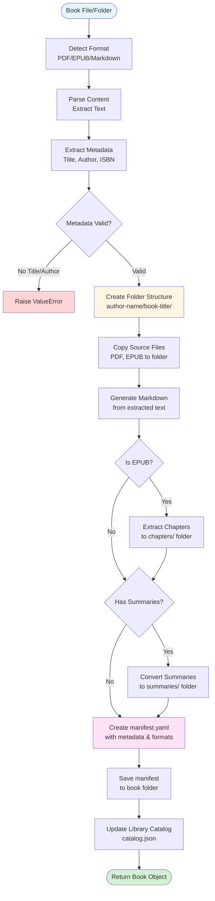

# Development Guide

> **[← Back to Main README](../README.md)** | **[Implementation Plan](IMPLEMENTATION_PLAN.md)** | **[CLI Commands](CLI_COMMANDS_ANALYSIS.md)**

This guide covers everything you need to know to contribute to Resource Librarian.

## Table of Contents

- [Project Setup](#project-setup)
- [Running Tests](#running-tests)
- [Code Quality](#code-quality)
- [Project Structure](#project-structure)
- [Writing Tests](#writing-tests)
- [Contributing](#contributing)

## Project Setup

### Prerequisites

- Python 3.11 or higher
- Git
- Virtual environment (venv)

### Development Installation

1. **Clone the repository:**

```bash
git clone git@github.com:kennyrnwilson/resource-librarian.git
cd resource-librarian
```

2. **Create and activate virtual environment:**

```bash
# Create venv
python -m venv venv

# Activate on Linux/macOS
source venv/bin/activate

# Activate on Windows PowerShell
.\venv\Scripts\Activate.ps1

# Activate on Windows CMD
.\venv\Scripts\activate.bat
```

3. **Install in editable mode with dev dependencies:**

```bash
pip install -e ".[dev]"
```

This installs:
- The `resourcelibrarian` package in editable mode
- All runtime dependencies
- Development tools (pytest, ruff, coverage)

## Running Tests

### Run All Tests

```bash
pytest tests/ -v
```

Output example:
```
tests/test_library.py::test_initialize_library PASSED
tests/test_models.py::test_book_manifest_creation PASSED
tests/test_cli_init.py::test_cli_init_command PASSED
================================ 143 passed in 2.34s ================================
```

### Run Tests with Coverage

```bash
pytest tests/ --cov=src/resourcelibrarian --cov-report=term-missing
```

This shows:
- Overall coverage percentage
- Coverage per module
- Line-by-line coverage
- Missing lines that aren't covered

Example output:
```
Name                                              Stmts   Miss  Cover   Missing
-------------------------------------------------------------------------------
src/resourcelibrarian/__init__.py                     4      0   100%
src/resourcelibrarian/library.py                     89     12    87%   45-48, 102-105
src/resourcelibrarian/models.py                      67      5    93%   123-127
src/resourcelibrarian/sources/book_parser.py        156     53    66%   25-33, 45-57
-------------------------------------------------------------------------------
TOTAL                                               543    245    55%
```

### Run Specific Test Files

```bash
# Test a specific file
pytest tests/test_library.py -v

# Test a specific test function
pytest tests/test_library.py::test_initialize_library -v

# Test with pattern matching
pytest tests/ -k "test_book" -v
```

### Generate HTML Coverage Report

```bash
pytest tests/ --cov=src/resourcelibrarian --cov-report=html
```

Then open `htmlcov/index.html` in your browser for an interactive coverage report.

## Code Quality

This project uses [Ruff](https://github.com/astral-sh/ruff) for both linting and formatting.

### Linting

Check for code issues:

```bash
# Check all files
ruff check .

# Check specific directory
ruff check src/

# Auto-fix issues where possible
ruff check . --fix
```

### Formatting

Format code to project standards:

```bash
# Check formatting (don't modify files)
ruff format . --check

# Format all files
ruff format .

# Format specific file
ruff format src/resourcelibrarian/library.py
```

### Configuration

Ruff is configured in `pyproject.toml`:

```toml
[tool.ruff]
line-length = 100
target-version = "py311"

[tool.ruff.lint]
select = ["E", "F", "W"]
ignore = ["E501"]

[tool.ruff.format]
line-length = 100
```

### Pre-commit Checks

Before committing, run:

```bash
# Format code
ruff format .

# Check linting
ruff check . --fix

# Run tests
pytest tests/ -v
```

## Project Structure

```
resource-librarian/
├── src/
│   └── resourcelibrarian/
│       ├── __init__.py           # Package exports
│       ├── cli.py                # CLI entry points (Typer)
│       ├── library.py            # ResourceLibrary class
│       ├── models.py             # Pydantic data models
│       ├── utils.py              # Shared utilities
│       └── sources/              # Resource ingestion
│           ├── __init__.py
│           ├── book_parser.py    # PDF/EPUB/Markdown parsing
│           ├── book_ingestion.py # Book addition pipeline
│           ├── book_folder_scanner.py
│           └── epub_chapter_extractor.py
│
├── tests/
│   ├── test_library.py           # Library initialization tests
│   ├── test_models.py            # Data model tests
│   ├── test_utils.py             # Utility function tests
│   ├── test_cli_init.py          # CLI command tests
│   └── test_sources_book_parser.py
│
├── docs/
│   ├── DEVELOPMENT.md            # This file
│   ├── IMPLEMENTATION_PLAN.md    # Project roadmap
│   └── CLI_COMMANDS_ANALYSIS.md  # Command specifications
│
├── pyproject.toml                # Project metadata & dependencies
├── README.md                     # User-facing documentation
└── .gitignore
```

### Key Modules

#### `library.py`
- `ResourceLibrary` class - Main library management
- Methods: `initialize()`, `add_book()`, `list_books()`

#### `models.py`
- Pydantic models for data validation
- `BookManifest`, `VideoManifest`, `Book`, `Video`
- `LibraryMetadata`, `Catalog`

#### `cli.py`
- Typer-based CLI commands
- Command groups: `book`, `video`, `init`

#### `sources/book_parser.py`
- Multi-format book parsing
- PDF extraction (PyMuPDF)
- EPUB extraction (ebooklib)
- HTML-to-Markdown conversion
- Metadata extraction

#### `utils.py`
- File I/O helpers
- YAML/JSON reading and writing
- Hash computation

### Book Ingestion Pipeline

Understanding how books are processed helps when debugging or adding features:



**Pipeline Steps:**

1. **Format Detection** - Identify PDF, EPUB, or Markdown
2. **Content Parsing** - Extract text using format-specific parsers
3. **Metadata Extraction** - Get title, author, ISBN from EPUB metadata or text patterns
4. **Validation** - Ensure required fields (title, author) are present
5. **Organization** - Create `lastname-firstname/book-title/` folder structure
6. **File Management** - Copy originals, generate markdown, extract chapters
7. **Manifest Creation** - Generate `manifest.yaml` with all metadata
8. **Catalog Update** - Add to library's searchable catalog

## Source Module API Reference

This section documents the public methods available in each source module for book ingestion and parsing.

### book_parser.py

The `BookParser` class provides methods for extracting text from various book formats and extracting metadata.

#### `BookParser.parse(file_path: Path) -> str`

Auto-detects format and extracts text from a book file.

```python
from pathlib import Path
from resourcelibrarian.sources.book_parser import BookParser

# Parse any supported format
text = BookParser.parse(Path("book.epub"))
```

**Parameters:**
- `file_path` - Path to book file (PDF, EPUB, or Markdown)

**Returns:** Extracted text content as string

**Raises:** `ValueError` if format is unsupported

---

#### `BookParser.detect_format(file_path: Path) -> str | None`

Detect book format from file extension.

```python
format_type = BookParser.detect_format(Path("book.epub"))
# Returns: "epub"
```

**Parameters:**
- `file_path` - Path to book file

**Returns:** Format string (`'pdf'`, `'epub'`, `'markdown'`) or `None` if unsupported

---

#### `BookParser.parse_pdf(file_path: Path) -> str`

Extract text from a PDF file using PyMuPDF.

```python
text = BookParser.parse_pdf(Path("book.pdf"))
```

**Parameters:**
- `file_path` - Path to PDF file

**Returns:** Extracted text content

**Note:** Pages are separated by double newlines

---

#### `BookParser.parse_epub(file_path: Path) -> str`

Extract text from an EPUB file and convert to Markdown.

```python
text = BookParser.parse_epub(Path("book.epub"))
```

**Parameters:**
- `file_path` - Path to EPUB file

**Returns:** Extracted text content in Markdown format

**Note:** HTML content is converted to Markdown preserving headings, bold, italic, etc.

---

#### `BookParser.parse_markdown(file_path: Path) -> str`

Read text from a Markdown file.

```python
text = BookParser.parse_markdown(Path("book.md"))
```

**Parameters:**
- `file_path` - Path to Markdown file

**Returns:** File content as-is

---

#### `BookParser.extract_epub_metadata(file_path: Path) -> dict[str, str | None]`

Extract metadata from EPUB file using Dublin Core metadata.

```python
metadata = BookParser.extract_epub_metadata(Path("book.epub"))
# Returns: {
#     "title": "Python Programming",
#     "author": "John Smith",
#     "publisher": "Tech Books Inc",
#     "language": "en",
#     "isbn": "978-1234567890"
# }
```

**Parameters:**
- `file_path` - Path to EPUB file

**Returns:** Dictionary with keys: `title`, `author`, `publisher`, `language`, `isbn` (values are `None` if not found)

---

#### `clean_text(text: str) -> str`

Clean extracted text by removing excessive whitespace.

```python
from resourcelibrarian.sources.book_parser import clean_text

cleaned = clean_text(raw_text)
```

**Parameters:**
- `text` - Raw extracted text

**Returns:** Cleaned text with normalized whitespace

**Transformations:**
- Removes more than 2 consecutive newlines
- Strips leading/trailing whitespace from each line

---

#### `extract_metadata_from_text(text: str) -> dict[str, str | None]`

Try to extract basic metadata from text content using pattern matching.

```python
from resourcelibrarian.sources.book_parser import extract_metadata_from_text

metadata = extract_metadata_from_text(book_text)
# Returns: {"title": "...", "author": "..."}
```

**Parameters:**
- `text` - Book text content

**Returns:** Dictionary with `title` and `author` keys (values are `None` if not found)

**How it works:**
- Analyzes first 20 lines of text
- Matches author patterns like "by John Smith" or "Author: John Smith"
- Finds title from first substantial line (5-100 chars, has capital letters)
- Skips common front matter (Praise, Dedication, Copyright, etc.)

---

### book_ingestion.py

The `BookIngestion` class handles adding books to the library with automatic organization.

#### `BookIngestion.add_book(...)`

Add a book to the library from file(s).

```python
from pathlib import Path
from resourcelibrarian.sources.book_ingestion import BookIngestion

ingestion = BookIngestion(library_path=Path("/path/to/library"))

# Add with auto-detection
book = ingestion.add_book(
    file_path=Path("book.epub")
)

# Add with manual metadata
book = ingestion.add_book(
    file_path=Path("book.pdf"),
    title="Python Programming",
    author="John Smith",
    categories=["Programming", "Python"],
    tags=["beginner", "tutorial"]
)

# Add multiple formats
book = ingestion.add_book(
    file_path=[Path("book.epub"), Path("book.pdf")],
    prefer_format="epub"
)
```

**Parameters:**
- `file_path` - Path to book file(s). Can be single `Path` or list of `Path` objects
- `title` - Book title (optional, auto-detected if not provided)
- `author` - Book author (optional, auto-detected if not provided)
- `categories` - List of categories (optional)
- `tags` - List of tags (optional)
- `isbn` - ISBN number (optional, auto-detected from EPUB)
- `prefer_format` - Preferred format for text extraction (`"epub"`, `"pdf"`, or `"markdown"`)

**Returns:** `Book` instance

**Raises:**
- `FileNotFoundError` - If book file not found
- `ValueError` - If format unsupported or required metadata missing

**What it does:**
1. Validates files exist
2. Selects preferred format for text extraction
3. Parses content and extracts metadata
4. Creates folder: `lastname-firstname/book-title/`
5. Copies source files
6. Generates Markdown version
7. Extracts EPUB chapters (if applicable)
8. Creates `manifest.yaml`
9. Updates library catalog

---

#### `BookIngestion.add_book_from_folder(...)`

Add a book from a structured folder with auto-detection of formats and summaries.

```python
# Folder structure:
# my-book/
#   ├── my-book.epub
#   ├── my-book.pdf
#   ├── my-book-summary-shortform.pdf
#   └── my-book-summary-claude.md

book = ingestion.add_book_from_folder(
    folder_path=Path("/path/to/my-book"),
    categories=["Technology"],
    prefer_format="epub"
)
```

**Parameters:**
- `folder_path` - Path to book folder
- `title` - Book title (optional, auto-detected)
- `author` - Book author (optional, auto-detected)
- `categories` - List of categories (optional)
- `tags` - List of tags (optional)
- `isbn` - ISBN number (optional)
- `prefer_format` - Preferred format for text extraction

**Returns:** `Book` instance

**Raises:**
- `ValueError` - If no book formats found or metadata missing

**Folder Detection Rules:**
- Book formats: Files named `{folder-name}.{ext}` where ext is pdf, epub, md, txt
- Summary files: Match patterns like `{folder-name}-summary-{type}.{ext}`

**What it does:**
1. Scans folder for book formats and summaries
2. Extracts text from preferred format
3. Extracts metadata from EPUB or text
4. Creates organized structure in library
5. Copies all book formats
6. Converts summaries to Markdown
7. Extracts EPUB chapters
8. Creates manifest and updates catalog

---

#### Helper Functions

##### `slugify(text: str) -> str`

Convert text to URL-safe slug.

```python
from resourcelibrarian.sources.book_ingestion import slugify

slug = slugify("Python Programming!")
# Returns: "python-programming"
```

---

##### `parse_author_name(author: str) -> tuple[str, str]`

Parse author name into first and last name.

```python
from resourcelibrarian.sources.book_ingestion import parse_author_name

firstname, lastname = parse_author_name("John Smith")
# Returns: ("John", "Smith")

firstname, lastname = parse_author_name("Smith, John")
# Returns: ("John", "Smith")

firstname, lastname = parse_author_name("Jane Doe Jr.")
# Returns: ("Jane", "Doe Jr.")
```

**Supported Formats:**
- "First Last" → (First, Last)
- "Last, First" → (First, Last)
- Single name → ("", Name)

---

##### `create_book_folder_path(title: str, author: str) -> str`

Create folder path for a book.

```python
from resourcelibrarian.sources.book_ingestion import create_book_folder_path

path = create_book_folder_path("Python Programming", "John Smith")
# Returns: "smith-john/python-programming"
```

**Returns:** Folder path in format: `lastname-firstname/book-title`

---

### book_folder_scanner.py

The `BookFolderScanner` class scans structured book folders to detect formats and summaries.

#### `BookFolderScanner.scan() -> dict`

Scan folder and categorize files.

```python
from pathlib import Path
from resourcelibrarian.sources.book_folder_scanner import BookFolderScanner

scanner = BookFolderScanner(Path("/path/to/book-folder"))
result = scanner.scan()

# Returns:
# {
#     "book_formats": [("epub", Path("book.epub")), ("pdf", Path("book.pdf"))],
#     "summaries": [("shortform", "pdf", Path("book-summary-shortform.pdf"))],
#     "other_files": [Path("notes.txt")]
# }
```

**Returns:** Dictionary with:
- `book_formats` - List of `(format, path)` tuples for main book files
- `summaries` - List of `(summary_type, format, path)` tuples
- `other_files` - List of other files found

---

#### `BookFolderScanner.get_preferred_format(...)`

Get preferred format for text extraction.

```python
book_formats = [("epub", Path("book.epub")), ("pdf", Path("book.pdf"))]
preferred = scanner.get_preferred_format(book_formats, prefer="epub")
# Returns: Path("book.epub")
```

**Parameters:**
- `book_formats` - List of `(format, path)` tuples
- `prefer` - Preferred format (`"epub"`, `"pdf"`, `"md"`)

**Returns:** `Path` to preferred format or `None`

**Fallback order:** epub → pdf → md → txt

---

#### `BookFolderScanner.extract_markdown_from_summary(summary_path: Path) -> str`

Extract markdown text from summary file (any format).

```python
markdown = scanner.extract_markdown_from_summary(Path("summary.pdf"))
```

**Parameters:**
- `summary_path` - Path to summary file (md, txt, pdf, or epub)

**Returns:** Markdown text

**Raises:** `ValueError` if format unsupported

---

#### `BookFolderScanner.get_summary_output_name(summary_type: str, original_format: str) -> str`

Get output filename for summary.

```python
filename = scanner.get_summary_output_name("shortform", "pdf")
# Returns: "shortform-summary.md"
```

**Parameters:**
- `summary_type` - Type of summary (e.g., `"shortform"`, `"claude-sonnet-4.5"`)
- `original_format` - Original format (`"pdf"`, `"epub"`, `"md"`)

**Returns:** Output filename (always `.md` extension)

---

### epub_chapter_extractor.py

The `EpubChapterExtractor` class extracts individual chapters from EPUB files.

#### `EpubChapterExtractor.extract_chapters() -> list`

Extract chapters from EPUB.

```python
from pathlib import Path
from resourcelibrarian.sources.epub_chapter_extractor import EpubChapterExtractor

extractor = EpubChapterExtractor(Path("book.epub"))
chapters = extractor.extract_chapters()

# Returns:
# [
#     (1, "Introduction", "# Introduction\n\nContent..."),
#     (2, "Chapter 1: Getting Started", "# Chapter 1: Getting Started\n\nContent..."),
#     ...
# ]
```

**Returns:** List of `(chapter_number, title, markdown_content)` tuples

**How it works:**
- Follows EPUB spine (reading order)
- Converts HTML to Markdown
- Skips empty/short content
- Extracts chapter titles from headings
- Filters out front matter (copyright, TOC, etc.)

---

#### `EpubChapterExtractor.save_chapters(output_dir: Path) -> list`

Extract and save chapters to individual files.

```python
extractor = EpubChapterExtractor(Path("book.epub"))
saved = extractor.save_chapters(Path("chapters/"))

# Returns:
# [
#     (1, "Introduction", Path("chapters/1-introduction.md")),
#     (2, "Chapter 1: Getting Started", Path("chapters/2-chapter-1-getting-started.md")),
#     ...
# ]
```

**Parameters:**
- `output_dir` - Directory to save chapter files

**Returns:** List of `(chapter_number, title, file_path)` tuples

**Raises:** `ValueError` if no chapters found in EPUB

**Filename Format:** `{number}-{slugified-title}.md`

Examples:
- "Introduction" → `1-introduction.md`
- "Chapter 1: Management 101" → `2-chapter-1-management-101.md`

---

## Writing Tests

### Test Structure

Resource Librarian uses pytest with the following patterns:

#### Unit Tests

Test individual functions and classes in isolation:

```python
# tests/test_library.py
from pathlib import Path
import pytest
from resourcelibrarian.library import ResourceLibrary

def test_initialize_library(tmp_path):
    """Test library initialization creates correct structure."""
    library = ResourceLibrary(tmp_path)
    library.initialize()

    assert (tmp_path / ".metadata" / "catalog.json").exists()
    assert (tmp_path / "books").exists()
    assert (tmp_path / "videos").exists()
```

#### CLI Integration Tests

Test CLI commands using Typer's testing utilities:

```python
# tests/test_cli_init.py
from typer.testing import CliRunner
from resourcelibrarian.cli import app

runner = CliRunner()

def test_cli_init_command(tmp_path):
    """Test the 'rl init' command."""
    library_path = tmp_path / "my-library"

    result = runner.invoke(app, ["init", str(library_path)])

    assert result.exit_code == 0
    assert "Library initialized" in result.stdout
    assert (library_path / ".metadata").exists()
```

**Why use CliRunner:**
- No subprocess overhead
- Direct command invocation
- Easy to test output and exit codes
- Documentation: https://typer.tiangolo.com/tutorial/testing/

#### Test Fixtures

Use pytest fixtures for shared test setup:

```python
import pytest
from pathlib import Path

@pytest.fixture
def library_dir(tmp_path):
    """Create and initialize a test library."""
    library = ResourceLibrary(tmp_path)
    library.initialize()
    return tmp_path

def test_add_book(library_dir):
    """Test adding a book to initialized library."""
    # library_dir is already initialized
    book_path = library_dir / "books" / "test.epub"
    # ... test implementation
```

### Test Coverage Goals

- **Overall:** Aim for 80%+ coverage
- **Core modules:** 90%+ coverage
  - `library.py`
  - `models.py`
  - `utils.py`
- **CLI commands:** 100% coverage of happy paths
- **Parsers:** 70%+ (some features require real files)

### Running Coverage Analysis

```bash
# Check current coverage
pytest tests/ --cov=src/resourcelibrarian --cov-report=term-missing

# Find untested code
pytest tests/ --cov=src/resourcelibrarian --cov-report=term-missing | grep "0%"

# Generate detailed HTML report
pytest tests/ --cov=src/resourcelibrarian --cov-report=html
open htmlcov/index.html
```

## Contributing

### Workflow

1. **Fork the repository**
2. **Create a feature branch:**
   ```bash
   git checkout -b feature/your-feature-name
   ```
3. **Make your changes**
4. **Write/update tests**
5. **Run quality checks:**
   ```bash
   ruff format .
   ruff check . --fix
   pytest tests/ -v
   ```
6. **Commit your changes:**
   ```bash
   git add .
   git commit -m "feat: add your feature description"
   ```
7. **Push to your fork:**
   ```bash
   git push origin feature/your-feature-name
   ```
8. **Create a Pull Request**

### Commit Message Convention

Use conventional commit format:

- `feat:` New features
- `fix:` Bug fixes
- `docs:` Documentation changes
- `test:` Test additions/changes
- `refactor:` Code refactoring
- `chore:` Build/tooling changes

Examples:
```
feat: add EPUB chapter extraction
fix: handle missing ISBN in metadata
docs: update installation instructions
test: add coverage for book parsing
```

### Code Style Guidelines

- **Line length:** 100 characters (enforced by Ruff)
- **Type hints:** Use type hints for function signatures
- **Docstrings:** Use Google-style docstrings
- **Imports:** Organize with Ruff (automatic)

Example function:

```python
def parse_author_name(author: str) -> tuple[str, str]:
    """Parse author name into first and last name.

    Handles various formats:
    - "John Smith" -> ("John", "Smith")
    - "Smith, John" -> ("John", "Smith")
    - "Jane Doe Jr." -> ("Jane", "Doe Jr.")

    Args:
        author: Author name in any common format

    Returns:
        Tuple of (firstname, lastname)
    """
    # Implementation...
```

### Testing Your Changes

Before submitting a PR:

1. **All tests pass:**
   ```bash
   pytest tests/ -v
   ```

2. **Coverage doesn't decrease:**
   ```bash
   pytest tests/ --cov=src/resourcelibrarian --cov-report=term
   ```

3. **Code quality passes:**
   ```bash
   ruff check .
   ruff format . --check
   ```

4. **Manual testing:**
   - Install in dev mode: `pip install -e .`
   - Test affected commands: `rl <command>`

## Development Roadmap

See [IMPLEMENTATION_PLAN.md](IMPLEMENTATION_PLAN.md) for:
- Current phase status
- Upcoming features
- Long-term goals

## Getting Help

- **Issues:** Use GitHub Issues for bugs and feature requests
- **Discussions:** Use GitHub Discussions for questions
- **Email:** Contact Kenny Wilson (see README)

## Additional Resources

- [Pytest Documentation](https://docs.pytest.org/)
- [Typer Documentation](https://typer.tiangolo.com/)
- [Ruff Documentation](https://docs.astral.sh/ruff/)
- [Pydantic Documentation](https://docs.pydantic.dev/)
