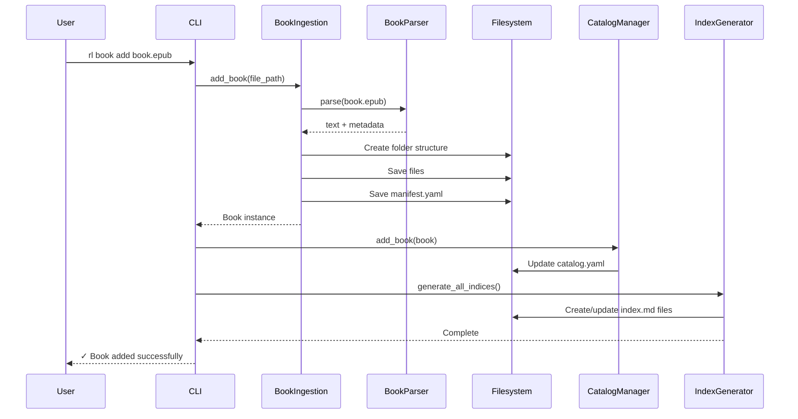

# Getting Started with Resource Librarian Development

This guide will help you set up your development environment for Resource Librarian.

---

## Prerequisites

Before you begin, ensure you have:

- **Python 3.11 or higher** - Resource Librarian requires modern Python
- **Git** - For version control
- **Text editor or IDE** - VS Code, PyCharm, or your preferred editor

### Verify Python Version

```bash
python --version
# Should show: Python 3.11.x or higher
```

If you need to install Python 3.11+:
- **macOS**: `brew install python@3.11`
- **Ubuntu/Debian**: `sudo apt install python3.11`
- **Windows**: Download from [python.org](https://www.python.org/downloads/)

---

## Development Setup

### 1. Clone the Repository

```bash
# Clone via SSH
git clone git@github.com:kennyrnwilson/resource-librarian.git
cd resource-librarian

# Or clone via HTTPS
git clone https://github.com/kennyrnwilson/resource-librarian.git
cd resource-librarian
```

### 2. Create Virtual Environment

Always use a virtual environment to isolate dependencies:

```bash
# Create virtual environment
python -m venv venv

# Activate virtual environment
# On macOS/Linux:
source venv/bin/activate

# On Windows PowerShell:
.\venv\Scripts\Activate.ps1

# On Windows CMD:
.\venv\Scripts\activate.bat
```

You should see `(venv)` in your terminal prompt, indicating the virtual environment is active.

### 3. Install Dependencies

Install the package in editable mode with development dependencies:

```bash
# Upgrade pip first
pip install --upgrade pip

# Install package in editable mode with dev dependencies
pip install -e ".[dev]"
```

This installs:
- **Core dependencies**: pydantic, pyyaml, typer, rich, pymupdf, ebooklib, etc.
- **Dev dependencies**: pytest, pytest-cov, ruff

### 4. Verify Installation

```bash
# Check that the CLI is available
rl --version

# Should show: resource-librarian, version 0.1.0

# Run the test suite
pytest tests/

# Should show: All tests passed
```

---

## Project Structure

Understanding where everything lives:

```text
resource-librarian/
├── src/resourcelibrarian/       # Main source code
│   ├── __init__.py             # Package initialization
│   ├── __main__.py             # CLI entry point (rl command)
│   │
│   ├── cli/                    # Command-line interface
│   │   ├── __init__.py
│   │   └── commands.py         # All CLI commands (book, video, catalog)
│   │
│   ├── core/                   # Core library systems
│   │   ├── __init__.py
│   │   ├── catalog_manager.py  # Catalog CRUD operations
│   │   └── index_generator.py  # Generate markdown indices
│   │
│   ├── models/                 # Data models (Pydantic)
│   │   ├── __init__.py
│   │   ├── base.py            # Base model classes
│   │   ├── book.py            # Book and BookManifest
│   │   ├── video.py           # Video and VideoManifest
│   │   └── catalog.py         # Catalog model
│   │
│   ├── sources/                # Resource ingestion
│   │   ├── __init__.py
│   │   ├── book_ingestion.py       # Book import logic
│   │   ├── book_parser.py          # Parse PDF/EPUB/MD
│   │   ├── book_folder_scanner.py  # Scan structured folders
│   │   ├── epub_chapter_extractor.py  # Extract EPUB chapters
│   │   ├── video_ingestion.py      # Video import logic
│   │   ├── youtube_api.py          # YouTube Data API
│   │   └── youtube_transcript.py   # Transcript fetching
│   │
│   ├── utils/                  # Utility functions
│   │   ├── __init__.py
│   │   ├── hash.py            # Hashing utilities
│   │   └── io.py              # File I/O helpers
│   │
│   └── library.py             # ResourceLibrary class
│
├── tests/                      # Test suite
│   ├── test_cli_*.py          # CLI command tests
│   ├── test_*.py              # Unit tests
│   └── conftest.py            # Pytest fixtures
│
├── docs/                       # Developer documentation
│   ├── README.md              # Documentation hub
│   ├── GETTING_STARTED.md     # This file
│   └── ...
│
├── pyproject.toml             # Project metadata & dependencies
├── README.md                  # User-facing documentation
└── MANUAL_TESTING.md          # Manual testing guide
```

---

## Key Files to Know

| File | Purpose |
|------|---------|
| `src/resourcelibrarian/__main__.py` | Entry point for `rl` command |
| `src/resourcelibrarian/cli/commands.py` | All CLI commands (book, video, catalog) |
| `src/resourcelibrarian/core/catalog_manager.py` | Catalog add/remove/search operations |
| `src/resourcelibrarian/core/index_generator.py` | Generate markdown navigation indices |
| `src/resourcelibrarian/models/book.py` | Book data model and manifest |
| `src/resourcelibrarian/models/video.py` | Video data model and manifest |
| `src/resourcelibrarian/sources/book_ingestion.py` | Book import and processing |
| `src/resourcelibrarian/sources/book_parser.py` | Parse EPUB/PDF to text |
| `pyproject.toml` | Project metadata, dependencies, tool config |

---

## Development Workflow

### Running the CLI Locally

Since you installed with `pip install -e ".[dev]"`, the `rl` command uses your local source code:

```bash
# Any changes to src/ are immediately reflected
rl --help

# Test commands without installing
rl init /tmp/test-library
rl book add /path/to/book.epub --library /tmp/test-library
```

### Running Tests

```bash
# Run all tests
pytest tests/

# Run specific test file
pytest tests/test_cli_book.py

# Run with coverage report
pytest --cov=src/resourcelibrarian --cov-report=html

# View coverage report
open htmlcov/index.html
```

### Code Quality

Resource Librarian uses [Ruff](https://docs.astral.sh/ruff/) for linting and formatting:

```bash
# Format code
ruff format src/ tests/

# Run linter
ruff check src/ tests/

# Fix auto-fixable issues
ruff check --fix src/ tests/
```

**Before committing**, always run:

```bash
# Format and check
ruff format src/ tests/
ruff check src/ tests/

# Run tests
pytest tests/
```

---

## Making Your First Change

Let's walk through a simple example:

### Example: Add a New CLI Option

**Goal:** Add a `--verbose` flag to the `rl book list` command

**Step 1: Find the code**

Open `src/resourcelibrarian/cli/commands.py` and locate the `book_list` function (around line 100-200).

**Step 2: Add the option**

```python
@book_app.command("list")
def book_list(
    library_path: str = typer.Option(...),
    author: Optional[str] = typer.Option(None, ...),
    # Add new option:
    verbose: bool = typer.Option(False, "--verbose", "-v", help="Show detailed information"),
):
    # Implementation...
    if verbose:
        # Show more details
        console.print(f"[dim]Location: {book.folder_path}[/dim]")
```

**Step 3: Test your change**

```bash
# Run the command with your new flag
rl book list --verbose --library /tmp/test-library
```

**Step 4: Add a test**

Open `tests/test_cli_book.py` and add a test:

```python
def test_book_list_verbose(tmp_path, sample_books_library):
    """Test book list with verbose flag."""
    result = runner.invoke(app, [
        "book", "list",
        "--library", str(sample_books_library),
        "--verbose"
    ])

    assert result.exit_code == 0
    assert "Location:" in result.output
```

**Step 5: Run tests and linter**

```bash
# Format code
ruff format src/ tests/

# Check for issues
ruff check src/ tests/

# Run tests
pytest tests/test_cli_book.py::test_book_list_verbose
```

**Step 6: Commit your change**

```bash
git add src/resourcelibrarian/cli/commands.py tests/test_cli_book.py
git commit -m "feat: add --verbose flag to book list command"
```

---

## Understanding the Data Flow

When you run `rl book add /path/to/book.epub`, here's what happens:



**Key takeaway:** Everything flows through the CLI → Sources → Filesystem → Catalog → Indices

---

## Common Development Tasks

### Add a New Book Format

1. Update `BookParser.detect_format()` in `sources/book_parser.py`
2. Add parsing method (e.g., `parse_docx()`)
3. Update `BookParser.parse()` to handle new format
4. Add tests in `tests/test_book_parser.py`

### Add a New CLI Command

1. Add function to `cli/commands.py`
2. Use `@book_app.command()` or `@video_app.command()` decorator
3. Add Typer parameters with type hints
4. Add tests in `tests/test_cli_*.py`

### Modify Catalog Structure

1. Update models in `models/catalog.py`
2. Update `CatalogManager` in `core/catalog_manager.py`
3. Update tests in `tests/test_catalog_manager.py`
4. May need migration logic for existing libraries

### Change Index Generation

1. Update `IndexGenerator` in `core/index_generator.py`
2. Modify template methods for specific indices
3. Test with `pytest tests/test_index_generator.py`
4. Verify output manually with test library

---

## Debugging Tips

### Enable Debug Logging

Add logging to your code:

```python
import logging

logger = logging.getLogger(__name__)

def my_function():
    logger.debug("Debug info here")
    logger.info("Important info")
```

Run with logging:

```bash
# Set log level
export LOG_LEVEL=DEBUG
rl book add book.epub
```

### Use Python Debugger

Add breakpoints:

```python
def my_function():
    import pdb; pdb.set_trace()  # Debugger stops here
    # Your code...
```

### Inspect Test Failures

```bash
# Run with verbose output
pytest -vv tests/

# Run with print statements visible
pytest -s tests/

# Drop into debugger on failure
pytest --pdb tests/
```

---

## Getting Help

- **Documentation**: Start with [docs/README.md](README.md)
- **Architecture**: See [docs/ARCHITECTURE.md](ARCHITECTURE.md)
- **Dependencies**: See [docs/DEPENDENCIES.md](DEPENDENCIES.md)
- **Issues**: [GitHub Issues](https://github.com/kennyrnwilson/resource-librarian/issues)

---

## Next Steps

Now that you're set up:

1. **Read the [Architecture](ARCHITECTURE.md)** to understand the system design
2. **Read the [Dependencies](DEPENDENCIES.md)** to understand the libraries we use
3. **Explore the codebase** - Read through key modules
4. **Start building** - Try adding features or fixing bugs

---

**Happy coding!** You're all set to work with Resource Librarian.
