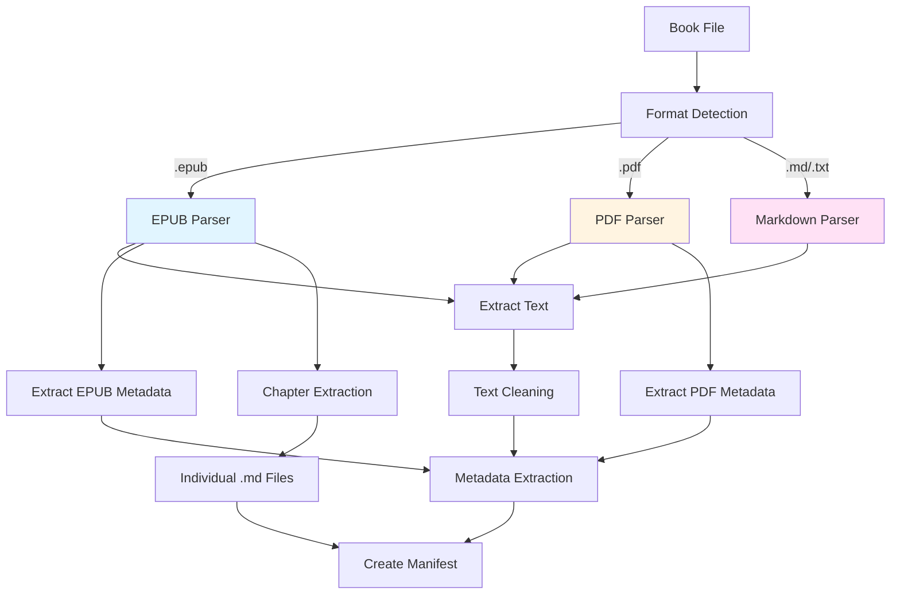

# Document Parsing

This document provides a comprehensive overview of how Resource Librarian parses different document formats (EPUB, PDF, Markdown) to extract text and metadata.

---

## Table of Contents

- [Overview](#overview)
- [Parsing Architecture](#parsing-architecture)
- [Format Detection](#format-detection)
- [EPUB Parsing](#epub-parsing)
- [PDF Parsing](#pdf-parsing)
- [Markdown Parsing](#markdown-parsing)
- [Text Cleaning](#text-cleaning)
- [Metadata Extraction](#metadata-extraction)
- [Chapter Extraction](#chapter-extraction)
- [Error Handling](#error-handling)

---

## Overview

Resource Librarian supports three primary book formats:

| Format | Support Level | Features |
|--------|---------------|----------|
| **EPUB** | ✅ Full | Text, metadata, chapters, structure |
| **PDF** | ✅ Good | Text extraction, basic metadata |
| **Markdown** | ✅ Full | Direct ingestion, no conversion needed |

**Parsing Goals:**
1. Extract clean, readable text
2. Preserve structure where possible
3. Extract metadata (title, author, ISBN)
4. Split into chapters (EPUB only)
5. Handle errors gracefully

---

## Parsing Architecture



**Key Components:**

- **`BookParser`** (`sources/book_parser.py`) - Main parsing class
  - `parse()` - Dispatcher based on format
  - `parse_epub()` - EPUB text extraction
  - `parse_pdf()` - PDF text extraction
  - `parse_markdown()` - Markdown reading
  - `detect_format()` - Format detection
  - `extract_epub_metadata()` - EPUB metadata

- **`EpubChapterExtractor`** (`sources/epub_chapter_extractor.py`)
  - Extract individual chapters from EPUB
  - Save as separate markdown files

- **Helper Functions**
  - `clean_text()` - Remove excess whitespace, normalize
  - `extract_metadata_from_text()` - Parse title/author from text

---

## Format Detection

Format detection is based on file extension:

```python
@staticmethod
def detect_format(file_path: Path) -> str | None:
    """Detect book format from file extension.

    Args:
        file_path: Path to book file

    Returns:
        Format string: 'epub', 'pdf', 'markdown', 'txt', or None
    """
    suffix = file_path.suffix.lower()

    if suffix == ".epub":
        return "epub"
    elif suffix == ".pdf":
        return "pdf"
    elif suffix in [".md", ".markdown"]:
        return "markdown"
    elif suffix == ".txt":
        return "txt"
    else:
        return None
```

**Why extension-based?**
- Simple and fast
- Reliable for well-formed files
- No need to read file content
- Sufficient for our use case

**Future enhancement:**
- Magic number detection for files without extensions
- Content-based detection as fallback

---

## EPUB Parsing

EPUB (Electronic Publication) is a ZIP-based format containing XHTML content.

### Libraries Used

- **ebooklib** - Read EPUB structure, access content
- **BeautifulSoup4** - Parse XHTML, extract text

### Text Extraction Process

```python
@staticmethod
def parse_epub(file_path: Path) -> str:
    """Extract text from EPUB file.

    Args:
        file_path: Path to EPUB file

    Returns:
        Extracted text as string
    """
    import ebooklib
    from ebooklib import epub
    from bs4 import BeautifulSoup

    # 1. Open EPUB
    book = epub.read_epub(str(file_path))

    # 2. Extract text from all documents in reading order
    text_parts = []
    for item in book.get_items_of_type(ebooklib.ITEM_DOCUMENT):
        # Get HTML content
        content = item.get_content().decode('utf-8')

        # Parse HTML and extract text
        soup = BeautifulSoup(content, 'html.parser')
        text = soup.get_text(separator='\n', strip=True)

        text_parts.append(text)

    # 3. Join all parts
    return '\n\n'.join(text_parts)
```

**Step-by-step:**

1. **Open EPUB** - `epub.read_epub()` opens the ZIP and parses structure
2. **Get documents** - EPUB spine defines reading order
3. **Extract HTML** - Each document is XHTML content
4. **Parse HTML** - BeautifulSoup extracts text from XHTML
5. **Join parts** - Combine all chapters with spacing

### Metadata Extraction

EPUB files contain Dublin Core metadata:

```python
@staticmethod
def extract_epub_metadata(file_path: Path) -> dict[str, str | None]:
    """Extract metadata from EPUB file.

    Args:
        file_path: Path to EPUB file

    Returns:
        Dict with title, author, isbn (all optional)
    """
    import ebooklib
    from ebooklib import epub

    book = epub.read_epub(str(file_path))

    metadata = {}

    # Title
    title_meta = book.get_metadata('DC', 'title')
    if title_meta:
        metadata['title'] = title_meta[0][0]

    # Author
    author_meta = book.get_metadata('DC', 'creator')
    if author_meta:
        metadata['author'] = author_meta[0][0]

    # ISBN
    isbn_meta = book.get_metadata('DC', 'identifier')
    if isbn_meta:
        # Try to find ISBN identifier
        for identifier in isbn_meta:
            if 'isbn' in str(identifier).lower():
                metadata['isbn'] = identifier[0]
                break

    return metadata
```

**Dublin Core (DC) metadata fields:**
- `DC:title` - Book title
- `DC:creator` - Author name
- `DC:identifier` - ISBN, DOI, etc.
- `DC:publisher` - Publisher name
- `DC:date` - Publication date
- `DC:language` - Language code

### Advantages of EPUB

✅ **Structured** - Clear document hierarchy
✅ **Metadata** - Rich Dublin Core metadata
✅ **Chapters** - Table of contents and spine
✅ **Clean text** - Well-formed XHTML
✅ **Portable** - Open standard format

### Challenges

❌ **Varied quality** - Some EPUBs have poor structure
❌ **Complex navigation** - TOC can be complex
❌ **Image handling** - Images need special handling (not yet implemented)

---

## PDF Parsing

PDF (Portable Document Format) is a page-based format designed for printing.

### Library Used

- **PyMuPDF (fitz)** - Fast, accurate PDF text extraction

### Text Extraction Process

```python
@staticmethod
def parse_pdf(file_path: Path) -> str:
    """Extract text from PDF file.

    Args:
        file_path: Path to PDF file

    Returns:
        Extracted text as string
    """
    import fitz  # PyMuPDF

    # 1. Open PDF
    doc = fitz.open(str(file_path))

    # 2. Extract text from each page
    text_parts = []
    for page_num in range(len(doc)):
        page = doc[page_num]
        text = page.get_text()
        text_parts.append(text)

    # 3. Close document
    doc.close()

    # 4. Join all pages
    return '\n\n'.join(text_parts)
```

**Step-by-step:**

1. **Open PDF** - `fitz.open()` loads PDF structure
2. **Iterate pages** - Process each page sequentially
3. **Extract text** - `page.get_text()` extracts text
4. **Join pages** - Combine with page breaks

### PDF Metadata Extraction

PDFs have metadata in document properties:

```python
# Get metadata
metadata = doc.metadata

title = metadata.get("title", "")
author = metadata.get("author", "")
subject = metadata.get("subject", "")
creator = metadata.get("creator", "")
```

**Metadata reliability:**
- ⚠️ Often missing or incorrect
- ⚠️ Not standardized (unlike EPUB)
- ✅ Worth trying, but need fallback

### Advantages of PDF

✅ **Universal** - Almost all books available as PDF
✅ **Fast extraction** - PyMuPDF is very fast
✅ **Stable** - Format doesn't change

### Challenges

❌ **No structure** - No semantic chapters or sections
❌ **Layout issues** - Text extraction can be messy
  - Multi-column layouts
  - Headers/footers on every page
  - Tables and figures
❌ **Poor metadata** - Often missing or wrong
❌ **No chapters** - Can't automatically split

**Example issues:**

```text
# Multi-column gets jumbled:
"This is column one text mixed with this is column two text"

# Headers/footers repeated:
"Page 42                    Chapter Title
Main content here...
Page 42                    Chapter Title"

# Tables broken:
"Cell1 Cell2 Cell3 Row1Data Row2Data Row3Data"
```

### Mitigation Strategies

1. **Text cleaning** - Remove repeated headers/footers (heuristics)
2. **Manual metadata** - Allow user to specify via CLI
3. **Fallback to text parsing** - Extract title/author from first pages
4. **Accept limitations** - PDFs won't have chapters

---

## Markdown Parsing

Markdown is the simplest format - already plain text!

### Text Extraction

```python
@staticmethod
def parse_markdown(file_path: Path) -> str:
    """Read markdown file.

    Args:
        file_path: Path to markdown file

    Returns:
        File contents as string
    """
    return file_path.read_text(encoding='utf-8')
```

**That's it!** Markdown is already text, no parsing needed.

### Advantages

✅ **No conversion** - Already plain text
✅ **Clean** - Human-readable
✅ **Structure preserved** - Markdown formatting intact
✅ **Fast** - Just file read

### Challenges

❌ **Rare** - Few books distributed as Markdown
❌ **No metadata** - Need manual specification

**Use cases:**
- Books already converted to Markdown
- Self-published Markdown books
- Technical documentation
- Imported from other systems

---

## Text Cleaning

After extraction, text is cleaned to improve readability:

```python
def clean_text(text: str) -> str:
    """Clean extracted text.

    Args:
        text: Raw extracted text

    Returns:
        Cleaned text
    """
    # 1. Normalize whitespace
    text = re.sub(r' +', ' ', text)  # Multiple spaces → single space
    text = re.sub(r'\n\n+', '\n\n', text)  # Multiple newlines → double newline

    # 2. Remove zero-width characters
    text = re.sub(r'[\u200b\u200c\u200d\ufeff]', '', text)

    # 3. Normalize quotes (optional)
    text = text.replace('"', '"').replace('"', '"')  # Smart quotes → straight
    text = text.replace(''', "'").replace(''', "'")

    # 4. Strip leading/trailing whitespace
    text = text.strip()

    return text
```

**Cleaning operations:**

1. **Whitespace normalization**
   - Multiple spaces → single space
   - Multiple newlines → double newline (paragraph break)

2. **Remove invisible characters**
   - Zero-width space (U+200B)
   - Zero-width non-joiner (U+200C)
   - Zero-width joiner (U+200D)
   - Byte order mark (U+FEFF)

3. **Normalize quotes (optional)**
   - Smart quotes → straight quotes
   - Easier for search and processing

4. **Trim whitespace**
   - Remove leading/trailing whitespace

**Future enhancements:**
- Remove repeated headers/footers (PDF-specific)
- Fix hyphenation across line breaks
- Normalize Unicode normalization forms

---

## Metadata Extraction

Metadata can come from three sources (in priority order):

### 1. EPUB Metadata (Best)

```python
metadata = BookParser.extract_epub_metadata(file_path)
title = metadata.get('title')
author = metadata.get('author')
isbn = metadata.get('isbn')
```

**Reliability:** ✅ High - EPUBs have structured metadata

### 2. PDF Metadata (Okay)

```python
doc = fitz.open(file_path)
title = doc.metadata.get('title')
author = doc.metadata.get('author')
```

**Reliability:** ⚠️ Medium - Often missing or wrong

### 3. Text-Based Extraction (Fallback)

Parse first few pages looking for title and author:

```python
def extract_metadata_from_text(text: str) -> dict[str, str | None]:
    """Extract metadata by parsing text content.

    Looks for patterns like:
    - Title in first line (often all caps or large)
    - "by Author Name" or "Author Name" on second line

    Args:
        text: Book text

    Returns:
        Dict with title and author (if found)
    """
    lines = text.split('\n')
    metadata = {}

    # Get first 10 non-empty lines
    first_lines = [line.strip() for line in lines if line.strip()][:10]

    if not first_lines:
        return metadata

    # First non-empty line is often title
    metadata['title'] = first_lines[0]

    # Look for "by Author" pattern in next few lines
    for line in first_lines[1:5]:
        if line.lower().startswith('by '):
            metadata['author'] = line[3:].strip()
            break
        # Sometimes just "Author Name" on second line
        if len(line.split()) <= 4:  # Author names typically short
            metadata['author'] = line
            break

    return metadata
```

**Reliability:** ⚠️ Low - Heuristics, not guaranteed

### Metadata Priority

```python
# Priority: EPUB > PDF > Text > User-provided

if epub_file:
    epub_metadata = extract_epub_metadata(epub_file)
    if not title:
        title = epub_metadata.get('title')
    if not author:
        author = epub_metadata.get('author')

if pdf_file and not title:
    pdf_metadata = extract_pdf_metadata(pdf_file)
    title = pdf_metadata.get('title')

if not title or not author:
    text_metadata = extract_metadata_from_text(text)
    if not title:
        title = text_metadata.get('title')
    if not author:
        author = text_metadata.get('author')

# User-provided always wins (if provided via CLI)
if user_title:
    title = user_title
if user_author:
    author = user_author
```

---

## Chapter Extraction

Only supported for EPUB files (PDFs don't have semantic chapters).

See [epub_chapter_extractor.py](../src/resourcelibrarian/sources/epub_chapter_extractor.py) for implementation.

### Process

1. **Read EPUB table of contents (TOC)**
   - NCX format (EPUB 2)
   - NAV format (EPUB 3)

2. **Extract each chapter**
   - Get chapter HTML content
   - Parse with BeautifulSoup
   - Convert to clean text
   - Save as markdown file

3. **Name chapters**
   - `01-chapter-title.md`
   - `02-another-chapter.md`
   - Numbered for reading order

### Example

```python
from resourcelibrarian.sources.epub_chapter_extractor import EpubChapterExtractor

extractor = EpubChapterExtractor("book.epub")
chapters_dir = Path("chapters/")
saved_chapters = extractor.save_chapters(chapters_dir)

# saved_chapters = [
#     (1, "Introduction", Path("chapters/01-introduction.md")),
#     (2, "Getting Started", Path("chapters/02-getting-started.md")),
#     ...
# ]
```

---

## Error Handling

### File Not Found

```python
if not file_path.exists():
    raise FileNotFoundError(f"Book file not found: {file_path}")
```

### Unsupported Format

```python
format_type = BookParser.detect_format(file_path)
if format_type is None:
    raise ValueError(f"Unsupported file format: {file_path.suffix}")
```

### Parsing Errors

```python
try:
    text = BookParser.parse_epub(file_path)
except Exception as e:
    # Log error
    logger.error(f"Failed to parse EPUB: {e}")
    # Try fallback to PDF or fail gracefully
    raise ValueError(f"Failed to parse EPUB file: {e}")
```

### Metadata Missing

```python
if not title:
    raise ValueError("Could not determine book title. Please provide it explicitly.")

if not author:
    raise ValueError("Could not determine book author. Please provide it explicitly.")
```

**User guidance:**
- Clear error messages
- Suggest fixes (e.g., "Use --title and --author flags")
- Graceful degradation where possible

---

## Performance

### Benchmarks

Parsing performance for a typical 300-page book:

| Format | Time | Notes |
|--------|------|-------|
| EPUB | 2-3 seconds | Includes chapter extraction |
| PDF | 0.5-1 second | PyMuPDF is very fast |
| Markdown | <0.1 seconds | Just file read |

**Factors:**
- File size
- PDF complexity (images, layout)
- EPUB structure (number of chapters)

### Optimization

**Current optimizations:**
- PyMuPDF (Rust-based) for fast PDF parsing
- Streaming where possible (don't load entire file in memory)

**Future optimizations:**
- Parallel page processing for large PDFs
- Cached metadata extraction
- Incremental parsing for very large files

---

## Future Enhancements

### Additional Formats

- **DOCX** - Microsoft Word documents
- **AZW/MOBI** - Kindle formats (convert to EPUB first)
- **HTML** - Web pages (similar to EPUB parsing)

### Enhanced PDF Parsing

- Multi-column detection and handling
- Header/footer removal (heuristics)
- Table and figure extraction
- OCR for scanned PDFs (using Tesseract)

### Better Chapter Detection

- Heuristic chapter detection for PDFs
  - Look for "Chapter N" patterns
  - Detect page breaks and headings
  - Split on consistent patterns

### Image Extraction

- Extract cover images
- Extract figures and diagrams
- Save as separate files

---

## Related Documentation

- **[Architecture](ARCHITECTURE.md)** - System architecture overview
- **[Dependencies](DEPENDENCIES.md)** - Why we chose each parsing library
- **[Getting Started](GETTING_STARTED.md)** - How to extend parsing

---

**Last Updated:** 2025-11-29
