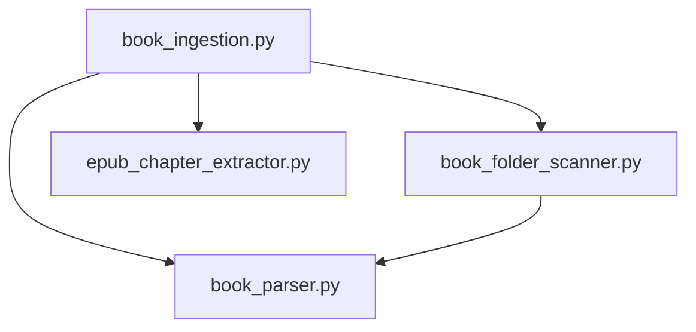

# Source Module API Reference

> **[← Back to Development Guide](../DEVELOPMENT.md)** | **[Main README](../../README.md)**

Complete API documentation for all source modules used in book ingestion and parsing.

## Modules

### Book Parsing
- **[book_parser.py](book_parser.md)** - Multi-format text extraction (PDF, EPUB, Markdown)
  - Format detection
  - PDF text extraction
  - EPUB to Markdown conversion
  - Metadata extraction
  - Text cleaning utilities

### Book Ingestion
- **[book_ingestion.py](book_ingestion.md)** - Add books to library
  - `BookIngestion.add_book()` - Import single/multiple book files
  - `BookIngestion.add_book_from_folder()` - Import structured folders
  - Helper functions for slugification and author parsing

### Folder Scanning
- **[book_folder_scanner.py](book_folder_scanner.md)** - Scan book folders
  - Detect book formats and summaries
  - Format preference selection
  - Summary extraction and conversion

### Chapter Extraction
- **[epub_chapter_extractor.py](epub_chapter_extractor.md)** - Extract EPUB chapters
  - Individual chapter extraction
  - HTML to Markdown conversion
  - Chapter title detection
  - Front matter filtering

## Quick Navigation

### By Use Case

**I want to...**

- **Extract text from a book file** → [BookParser.parse()](book_parser.md#bookparserparsefilepath-path---str)
- **Add a book to my library** → [BookIngestion.add_book()](book_ingestion.md#add_book)
- **Import a book folder with summaries** → [BookIngestion.add_book_from_folder()](book_ingestion.md#add_book_from_folder)
- **Get EPUB chapters separately** → [EpubChapterExtractor.save_chapters()](epub_chapter_extractor.md#save_chaptersoutputdir-path---listtupint-str-path)
- **Parse an author's name** → [parse_author_name()](book_ingestion.md#parseauthornameauthor-str---tuplestr-str)
- **Scan a folder for book files** → [BookFolderScanner.scan()](book_folder_scanner.md#scan---dict)

### By Module Dependency



**Dependencies:**
- `book_ingestion.py` uses all other modules
- `book_folder_scanner.py` uses `book_parser.py`
- `book_parser.py` and `epub_chapter_extractor.py` are independent

## Common Workflows

### Workflow 1: Add a Single Book File

```python
from pathlib import Path
from resourcelibrarian.sources.book_ingestion import BookIngestion

# Initialize ingestion
ingestion = BookIngestion(library_path=Path("/path/to/library"))

# Add book (auto-detects metadata)
book = ingestion.add_book(file_path=Path("book.epub"))

print(f"Added: {book.manifest.title} by {book.manifest.author}")
```

**Modules used:**
1. [book_ingestion.py](book_ingestion.md) - Main orchestration
2. [book_parser.py](book_parser.md) - Extract text and metadata
3. [epub_chapter_extractor.py](epub_chapter_extractor.md) - Extract chapters

---

### Workflow 2: Add Book with Multiple Formats

```python
# Add both EPUB and PDF
book = ingestion.add_book(
    file_path=[Path("book.epub"), Path("book.pdf")],
    title="Python Programming",
    author="John Smith",
    prefer_format="epub"  # Use EPUB for text extraction
)
```

**Modules used:**
1. [book_ingestion.py](book_ingestion.md) - File handling
2. [book_parser.py](book_parser.md) - Parse preferred format
3. [epub_chapter_extractor.py](epub_chapter_extractor.md) - Extract chapters from EPUB

---

### Workflow 3: Import Structured Folder

```python
# Folder structure:
# my-book/
#   ├── my-book.epub
#   ├── my-book.pdf
#   └── my-book-summary-shortform.pdf

book = ingestion.add_book_from_folder(
    folder_path=Path("my-book"),
    categories=["Programming"]
)
```

**Modules used:**
1. [book_ingestion.py](book_ingestion.md) - Orchestration
2. [book_folder_scanner.py](book_folder_scanner.md) - Detect formats and summaries
3. [book_parser.py](book_parser.md) - Extract text from book and summaries
4. [epub_chapter_extractor.py](epub_chapter_extractor.md) - Extract chapters

---

### Workflow 4: Extract Chapters Only

```python
from resourcelibrarian.sources.epub_chapter_extractor import EpubChapterExtractor

extractor = EpubChapterExtractor(Path("book.epub"))
chapters = extractor.save_chapters(Path("output/chapters/"))

for num, title, path in chapters:
    print(f"{num}. {title} → {path.name}")
```

**Modules used:**
1. [epub_chapter_extractor.py](epub_chapter_extractor.md) - Extract and save chapters

---

## See Also

- [Development Guide](../DEVELOPMENT.md) - Testing, code quality, project structure
- [Implementation Plan](../IMPLEMENTATION_PLAN.md) - Roadmap and phases
- [Main README](../../README.md) - Installation and usage
